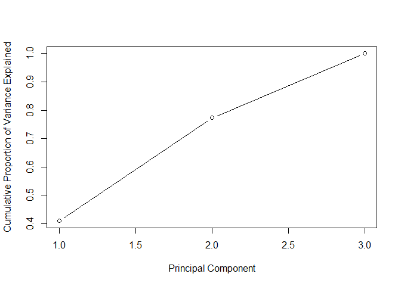
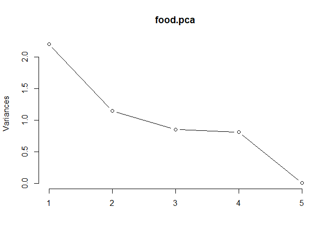
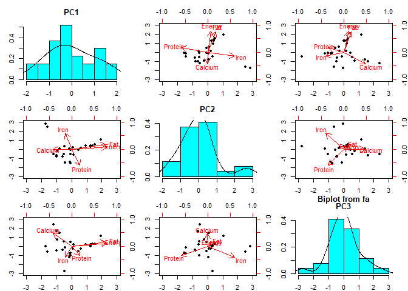

final exam
================
Erika Vargas
March 15, 2019

PROBLEM 1
=========

``` r
## covariance matrix
s <- rbind(c(5,0,0),c(0,9,0), c(0,0,8))

## a. eigen values and eigen vectors of S
eigen.s <- eigen(s)
eigen.s
```

    ## eigen() decomposition
    ## $values
    ## [1] 9 8 5
    ## 
    ## $vectors
    ##      [,1] [,2] [,3]
    ## [1,]    0    0    1
    ## [2,]    1    0    0
    ## [3,]    0    1    0

``` r
## b. percentage of variance explained
prop.var <- eigen.s$values[1:3] / sum(eigen.s$values)
prop.var
```

    ## [1] 0.4090909 0.3636364 0.2272727

``` r
cumsum(prop.var)
```

    ## [1] 0.4090909 0.7727273 1.0000000

``` r
## c. how many components to retain
plot(cumsum(prop.var), xlab = "Principal Component", ylab = "Cumulative Proportion of Variance Explained", type = "b")
```

 *For the example data, the scree plot markers for components 1–3 are non-linear, so components 1–3 should be kept.even though the first two components explain 77% of the data, 80% of variance explained would be better. It seem that the third component adds value.*

PROBLEM 2
=========

``` r
## building the correlation matrix
R <- matrix(rep(0,6*6), nrow=6, dimnames = list(c("French", "English", "History", "Arithmetic", "Algebra", "Geometry")))
diag(R) <- 1
R[lower.tri(R)] <- c(0.44,0.41,0.29,0.33,0.25,0.35,0.35
                               ,0.32,0.33,0.16,0.19,0.18,0.59,0.47,0.46)    
R
```

    ##            [,1] [,2] [,3] [,4] [,5] [,6]
    ## French     1.00 0.00 0.00 0.00 0.00    0
    ## English    0.44 1.00 0.00 0.00 0.00    0
    ## History    0.41 0.35 1.00 0.00 0.00    0
    ## Arithmetic 0.29 0.35 0.16 1.00 0.00    0
    ## Algebra    0.33 0.32 0.19 0.59 1.00    0
    ## Geometry   0.25 0.33 0.18 0.47 0.46    1

``` r
## Principal component loadings for 3 factors
library(psych)
```

    ## Warning: package 'psych' was built under R version 3.5.2

``` r
solution<- principal(R, nfactors = 3, rotate = 'none', covar = FALSE)
```

    ## Warning in log(det(r)): NaNs produced

    ## In factor.stats, the correlation matrix is singular, an approximation is used

    ## Warning in fa.stats(r = r, f = f, phi = phi, n.obs = n.obs, np.obs =
    ## np.obs, : In factor.stats, the correlation matrix is singular, and we could
    ## not calculate the beta weights for factor score estimates

    ## Warning in principal(R, nfactors = 3, rotate = "none", covar = FALSE): The
    ## matrix is not positive semi-definite, scores found from Structure loadings

``` r
solution$loadings
```

    ## 
    ## Loadings:
    ##      PC1    PC2    PC3   
    ## [1,] -0.843 -0.513 -0.132
    ## [2,]         0.843 -0.510
    ## [3,]         0.413  0.903
    ## [4,]  0.761 -0.217       
    ## [5,]  0.680 -0.316       
    ## [6,]  0.552 -0.151       
    ## 
    ##                  PC1   PC2   PC3
    ## SS loadings    2.074 1.314 1.105
    ## Proportion Var 0.346 0.219 0.184
    ## Cumulative Var 0.346 0.565 0.749

**First Principal Component Analysis - PCA1** The first principal component is a measure of the scores in French, Arithmetic, Algebra, and Geometry. As we can see this component is associated with low scores in french, moderately high scores in Arithmetic and Algebra.They are positively related to PCA1 because they all have positive signs\*

**Second Principal Component Analysis - PCA2** The second principal component is a measure of the scores for all 6 school subjects. PCA2 is associated with moderately high scores in English, and moderately low scores in History. It also shows low scores fro French and algebra.

**Third Principal Component Analysis - PCA3** The third principal component is a measure of the scores in French, English, and History. we can see very high scores in History, and moderately low scores in English and French\*

PROBLEM 3
=========

``` r
## loading FoodStuff dataset
dataset_3 <- read.csv("~/Desktop/WINTER 2019/DA410-MULTIVARIATE-CHENG/final/data_3.csv", header= TRUE, sep=" ", skipNul = T)
head(dataset_3,5)
```

    ##   ÿþFOOD Energy Protein Fat Calcium Iron
    ## 1     BB    340      20  28       9  2.6
    ## 2     HR    245      21  17       9  2.7
    ## 3     BR    420      15  39       7  2.0
    ## 4     BS    375      19  32       9  2.5
    ## 5     BC    180      22  10      17  3.7

``` r
View(dataset_3)
str(dataset_3)
```

    ## 'data.frame':    27 obs. of  6 variables:
    ##  $ ÿþFOOD : Factor w/ 27 levels "AC","AR","BB",..: 3 14 6 7 4 9 10 5 16 17 ...
    ##  $ Energy : int  340 245 420 375 180 115 170 160 265 300 ...
    ##  $ Protein: int  20 21 15 19 22 20 25 26 20 18 ...
    ##  $ Fat    : int  28 17 39 32 10 3 7 5 20 25 ...
    ##  $ Calcium: int  9 9 7 9 17 8 12 14 9 9 ...
    ##  $ Iron   : num  2.6 2.7 2 2.5 3.7 1.4 1.5 5.9 2.6 2.3 ...

``` r
FoodStuff <- dataset_3[,2:6] #taking food name off 
str(FoodStuff)
```

    ## 'data.frame':    27 obs. of  5 variables:
    ##  $ Energy : int  340 245 420 375 180 115 170 160 265 300 ...
    ##  $ Protein: int  20 21 15 19 22 20 25 26 20 18 ...
    ##  $ Fat    : int  28 17 39 32 10 3 7 5 20 25 ...
    ##  $ Calcium: int  9 9 7 9 17 8 12 14 9 9 ...
    ##  $ Iron   : num  2.6 2.7 2 2.5 3.7 1.4 1.5 5.9 2.6 2.3 ...

``` r
View(FoodStuff)
## correlation matrix
cor  <-cor(FoodStuff)
round(cor,3)
```

    ##         Energy Protein    Fat Calcium   Iron
    ## Energy   1.000   0.174  0.987  -0.320 -0.100
    ## Protein  0.174   1.000  0.025  -0.085 -0.175
    ## Fat      0.987   0.025  1.000  -0.308 -0.061
    ## Calcium -0.320  -0.085 -0.308   1.000  0.044
    ## Iron    -0.100  -0.175 -0.061   0.044  1.000

``` r
## principal component analysis function
# to decide the number of factors i used prcomp(). Performs a principal components analysis on the given data matrix and returns the results as an object of class prcomp.
food.pca <- prcomp(FoodStuff,
                 center = TRUE,
                 scale. = TRUE) 
## a. NUMBER OF FACTORS
eigenfood <-eigen(cor)
round(eigenfood$values,3) #first two factors have lambda > 1
```

    ## [1] 2.198 1.144 0.849 0.808 0.002

``` r
summary(food.pca)
```

    ## Importance of components:
    ##                           PC1    PC2    PC3    PC4     PC5
    ## Standard deviation     1.4825 1.0697 0.9212 0.8988 0.04000
    ## Proportion of Variance 0.4396 0.2288 0.1697 0.1616 0.00032
    ## Cumulative Proportion  0.4396 0.6684 0.8381 0.9997 1.00000

``` r
plot(food.pca, type= "l")
```



``` r
#PRINCIPAL COMPONENT Analysis
pca_food<- principal(FoodStuff, nfactors = 3, rotate = 'none', covar = FALSE)

# b. LOADINGS
round(pca_food$loadings,3)
```

    ## 
    ## Loadings:
    ##         PC1    PC2    PC3   
    ## Energy   0.969         0.137
    ## Protein  0.224 -0.739 -0.426
    ## Fat      0.948  0.216  0.199
    ## Calcium -0.526         0.601
    ## Iron    -0.181  0.737 -0.497
    ## 
    ##                  PC1   PC2   PC3
    ## SS loadings    2.197 1.145 0.848
    ## Proportion Var 0.439 0.229 0.170
    ## Cumulative Var 0.439 0.668 0.838

``` r
# C. VARIANCE EXPLAINED AND FACTORES SCORES
pca_food
```

    ## Principal Components Analysis
    ## Call: principal(r = FoodStuff, nfactors = 3, rotate = "none", covar = FALSE)
    ## Standardized loadings (pattern matrix) based upon correlation matrix
    ##           PC1   PC2   PC3   h2    u2 com
    ## Energy   0.97  0.09  0.14 0.97 0.033 1.1
    ## Protein  0.22 -0.74 -0.43 0.78 0.222 1.8
    ## Fat      0.95  0.22  0.20 0.98 0.015 1.2
    ## Calcium -0.53 -0.01  0.60 0.64 0.363 2.0
    ## Iron    -0.18  0.74 -0.50 0.82 0.177 1.9
    ## 
    ##                        PC1  PC2  PC3
    ## SS loadings           2.20 1.14 0.85
    ## Proportion Var        0.44 0.23 0.17
    ## Cumulative Var        0.44 0.67 0.84
    ## Proportion Explained  0.52 0.27 0.20
    ## Cumulative Proportion 0.52 0.80 1.00
    ## 
    ## Mean item complexity =  1.6
    ## Test of the hypothesis that 3 components are sufficient.
    ## 
    ## The root mean square of the residuals (RMSR) is  0.15 
    ##  with the empirical chi square  11.86  with prob <  NA 
    ## 
    ## Fit based upon off diagonal values = 0.83

``` r
prop.var.food <- (eigenfood$values[1:3] / sum(eigenfood$values) )*100
round(prop.var.food,3)  #percent of variance explained for each factor
```

    ## [1] 43.956 22.884 16.971

``` r
pca_food$fit #Fit of the model to the correlation matrix
```

    ## [1] 0.9131254

``` r
summary(pca_food)
```

    ## 
    ## Factor analysis with Call: principal(r = FoodStuff, nfactors = 3, rotate = "none", covar = FALSE)
    ## 
    ## Test of the hypothesis that 3 factors are sufficient.
    ## The degrees of freedom for the model is -2  and the objective function was  2.93 
    ## The number of observations was  27  with Chi Square =  62.99  with prob <  NA 
    ## 
    ## The root mean square of the residuals (RMSA) is  0.15

``` r
#plot for the factors scores
biplot(pca_food, scale = 0)
```

    ## Warning in plot.window(...): "scale" is not a graphical parameter

    ## Warning in plot.xy(xy, type, ...): "scale" is not a graphical parameter

    ## Warning in axis(side = side, at = at, labels = labels, ...): "scale" is not
    ## a graphical parameter

    ## Warning in axis(side = side, at = at, labels = labels, ...): "scale" is not
    ## a graphical parameter

    ## Warning in box(...): "scale" is not a graphical parameter

    ## Warning in title(...): "scale" is not a graphical parameter

    ## Warning in plot.window(...): "scale" is not a graphical parameter

    ## Warning in plot.xy(xy, type, ...): "scale" is not a graphical parameter

    ## Warning in title(...): "scale" is not a graphical parameter

    ## Warning in text.default(loadings, labels = labels, cex = cex[2L], col =
    ## col[2L], : "scale" is not a graphical parameter

    ## Warning in axis(3, col = col[2L], ...): "scale" is not a graphical
    ## parameter

    ## Warning in axis(4, col = col[2L], ...): "scale" is not a graphical
    ## parameter

    ## Warning in plot.window(...): "scale" is not a graphical parameter

    ## Warning in plot.xy(xy, type, ...): "scale" is not a graphical parameter

    ## Warning in axis(side = side, at = at, labels = labels, ...): "scale" is not
    ## a graphical parameter

    ## Warning in axis(side = side, at = at, labels = labels, ...): "scale" is not
    ## a graphical parameter

    ## Warning in box(...): "scale" is not a graphical parameter

    ## Warning in title(...): "scale" is not a graphical parameter

    ## Warning in plot.window(...): "scale" is not a graphical parameter

    ## Warning in plot.xy(xy, type, ...): "scale" is not a graphical parameter

    ## Warning in title(...): "scale" is not a graphical parameter

    ## Warning in text.default(loadings, labels = labels, cex = cex[2L], col =
    ## col[2L], : "scale" is not a graphical parameter

    ## Warning in axis(3, col = col[2L], ...): "scale" is not a graphical
    ## parameter

    ## Warning in axis(4, col = col[2L], ...): "scale" is not a graphical
    ## parameter

    ## Warning in plot.window(...): "scale" is not a graphical parameter

    ## Warning in plot.xy(xy, type, ...): "scale" is not a graphical parameter

    ## Warning in axis(side = side, at = at, labels = labels, ...): "scale" is not
    ## a graphical parameter

    ## Warning in axis(side = side, at = at, labels = labels, ...): "scale" is not
    ## a graphical parameter

    ## Warning in box(...): "scale" is not a graphical parameter

    ## Warning in title(...): "scale" is not a graphical parameter

    ## Warning in plot.window(...): "scale" is not a graphical parameter

    ## Warning in plot.xy(xy, type, ...): "scale" is not a graphical parameter

    ## Warning in title(...): "scale" is not a graphical parameter

    ## Warning in text.default(loadings, labels = labels, cex = cex[2L], col =
    ## col[2L], : "scale" is not a graphical parameter

    ## Warning in axis(3, col = col[2L], ...): "scale" is not a graphical
    ## parameter

    ## Warning in axis(4, col = col[2L], ...): "scale" is not a graphical
    ## parameter

    ## Warning in plot.window(...): "scale" is not a graphical parameter

    ## Warning in plot.xy(xy, type, ...): "scale" is not a graphical parameter

    ## Warning in axis(side = side, at = at, labels = labels, ...): "scale" is not
    ## a graphical parameter

    ## Warning in axis(side = side, at = at, labels = labels, ...): "scale" is not
    ## a graphical parameter

    ## Warning in box(...): "scale" is not a graphical parameter

    ## Warning in title(...): "scale" is not a graphical parameter

    ## Warning in plot.window(...): "scale" is not a graphical parameter

    ## Warning in plot.xy(xy, type, ...): "scale" is not a graphical parameter

    ## Warning in title(...): "scale" is not a graphical parameter

    ## Warning in text.default(loadings, labels = labels, cex = cex[2L], col =
    ## col[2L], : "scale" is not a graphical parameter

    ## Warning in axis(3, col = col[2L], ...): "scale" is not a graphical
    ## parameter

    ## Warning in axis(4, col = col[2L], ...): "scale" is not a graphical
    ## parameter

    ## Warning in plot.window(...): "scale" is not a graphical parameter

    ## Warning in plot.xy(xy, type, ...): "scale" is not a graphical parameter

    ## Warning in axis(side = side, at = at, labels = labels, ...): "scale" is not
    ## a graphical parameter

    ## Warning in axis(side = side, at = at, labels = labels, ...): "scale" is not
    ## a graphical parameter

    ## Warning in box(...): "scale" is not a graphical parameter

    ## Warning in title(...): "scale" is not a graphical parameter

    ## Warning in plot.window(...): "scale" is not a graphical parameter

    ## Warning in plot.xy(xy, type, ...): "scale" is not a graphical parameter

    ## Warning in title(...): "scale" is not a graphical parameter

    ## Warning in text.default(loadings, labels = labels, cex = cex[2L], col =
    ## col[2L], : "scale" is not a graphical parameter

    ## Warning in axis(3, col = col[2L], ...): "scale" is not a graphical
    ## parameter

    ## Warning in axis(4, col = col[2L], ...): "scale" is not a graphical
    ## parameter

    ## Warning in plot.window(...): "scale" is not a graphical parameter

    ## Warning in plot.xy(xy, type, ...): "scale" is not a graphical parameter

    ## Warning in axis(side = side, at = at, labels = labels, ...): "scale" is not
    ## a graphical parameter

    ## Warning in axis(side = side, at = at, labels = labels, ...): "scale" is not
    ## a graphical parameter

    ## Warning in box(...): "scale" is not a graphical parameter

    ## Warning in title(...): "scale" is not a graphical parameter

    ## Warning in plot.window(...): "scale" is not a graphical parameter

    ## Warning in plot.xy(xy, type, ...): "scale" is not a graphical parameter

    ## Warning in title(...): "scale" is not a graphical parameter

    ## Warning in text.default(loadings, labels = labels, cex = cex[2L], col =
    ## col[2L], : "scale" is not a graphical parameter

    ## Warning in axis(3, col = col[2L], ...): "scale" is not a graphical
    ## parameter

    ## Warning in axis(4, col = col[2L], ...): "scale" is not a graphical
    ## parameter

 *The second method says to retain the components whose eigen values are greater than the average of the eigen values (for correlation matrix, this average is 1).* *Since lambda for the first and second component is greater than 1, I am keeping those components, however the total of variance explained with just two components is only 67%,so keeping the third component whose eigen value is 0.85. would give us a 84% of variance explained. This satisfies the first method. of keeping factors that explain at least 80% of total variance.*

**Loadings interpretation**

**First Principal Component Analysis - PCA1** The first principal component is a measure of high amount of Energy, fat, and the moderately low amount of calcium. It associates all 5 variables.

**Second Principal Component Analysis - PCA2** The second principal component is a measure of the low amount of protein, and high amount of Iron.

**Third Principal Component Analysis - PCA3** The third principal component associates all variables and it measures the high amount of calcium, and the moderately low amount of protein and Iron.

*the first component explained 43.9% of variance, the second component explained 22.9% of variance, and the third component explained 17% of varaince.*

PROBLEM 4
=========

``` r
Problem4_dataset <- read.file("~/Desktop/WINTER 2019/DA410-MULTIVARIATE-CHENG/final/dataset_4.csv", sep=" ", skipNul = T, header = FALSE, col.names= c("patient #","y1","y2","x1","x2","x3"))
```

    ## Data from the .csv file ~/Desktop/WINTER 2019/DA410-MULTIVARIATE-CHENG/final/dataset_4.csv has been loaded.

``` r
 head(Problem4_dataset,5)
```

    ##   patient..   y1  y2  x1  x2  x3
    ## 1       ÿþ1 0.81  80 356 124  55
    ## 2         2 0.95  97 289 117  76
    ## 3         3 0.94 105 319 143 105
    ## 4         4 1.04  90 356 199 108
    ## 5         5 1.00  90 323 240 143

``` r
patients <- Problem4_dataset[,2:6] # taking the patient number off
 
patients.std <-sweep(patients, 2, sqrt(apply(patients,2,var)), FUN="/")
major.variables<-patients.std[,1:2]
major.variables
```

    ##          y1       y2
    ## 1  7.147090 12.27481
    ## 2  8.382389 14.88321
    ## 3  8.294154 16.11069
    ## 4  9.176510 13.80916
    ## 5  8.823568 13.80916
    ## 6  6.705911 13.19542
    ## 7  8.029446 15.34351
    ## 8  9.705924 13.04199
    ## 9  8.735332 14.88321
    ## 10 6.882383 14.88321
    ## 11 7.941211 13.96260
    ## 12 6.441204 13.34886
    ## 13 8.470625 11.96794
    ## 14 7.411797 13.80916
    ## 15 6.529440 13.19542
    ## 16 8.647096 12.27481
    ## 17 9.705924 13.80916
    ## 18 7.500032 15.19008
    ## 19 7.323561 13.04199
    ## 20 8.205918 13.80916
    ## 21 8.382389 13.80916
    ## 22 6.529440 13.50229
    ## 23 8.382389 14.57634
    ## 24 8.558861 13.80916
    ## 25 6.352969 14.11603

``` r
minor.variables <- patients.std[,3:5]
minor.variables
```

    ##           x1       x2       x3
    ## 1  10.625966 2.880459 1.636545
    ## 2   8.626135 2.717853 2.261407
    ## 3   9.521582 3.321820 3.124313
    ## 4  10.625966 4.622672 3.213579
    ## 5   9.640975 5.575082 4.255017
    ## 6  11.372172 3.647033 4.909634
    ## 7  10.446877 5.133721 3.540888
    ## 8   8.984314 4.320689 3.124313
    ## 9  11.312475 3.298590 2.916025
    ## 10  8.835073 3.043066 2.797004
    ## 11 10.536422 5.133721 1.577034
    ## 12  9.133555 4.134853 1.963854
    ## 13  8.655984 3.159213 4.225261
    ## 14 11.073690 4.645902 2.767249
    ## 15  9.312645 4.831738 2.023365
    ## 16 11.730350 4.692361 3.035047
    ## 17 10.864752 3.530885 2.261407
    ## 18 10.715511 4.297459 1.100948
    ## 19  8.835073 2.694623 1.785322
    ## 20 10.297636 2.857230 1.487768
    ## 21 11.282627 3.159213 1.398502
    ## 22  9.073859 3.112754 1.487768
    ## 23 10.357332 4.274230 2.707738
    ## 24  9.760368 4.460066 3.689665
    ## 25 11.521413 6.481033 2.201897

``` r
# a. canonical correlations between (y1,y2) and (x1,x2,x3)
#install.packages("CCA")
library(CCA)
```

    ## Warning: package 'CCA' was built under R version 3.5.2

    ## Loading required package: fda

    ## Warning: package 'fda' was built under R version 3.5.2

    ## Loading required package: splines

    ## Loading required package: Matrix

    ## 
    ## Attaching package: 'fda'

    ## The following object is masked from 'package:graphics':
    ## 
    ##     matplot

    ## Loading required package: fields

    ## Warning: package 'fields' was built under R version 3.5.2

    ## Loading required package: spam

    ## Warning: package 'spam' was built under R version 3.5.2

    ## Loading required package: dotCall64

    ## Warning: package 'dotCall64' was built under R version 3.5.2

    ## Loading required package: grid

    ## Spam version 2.2-1 (2018-12-20) is loaded.
    ## Type 'help( Spam)' or 'demo( spam)' for a short introduction 
    ## and overview of this package.
    ## Help for individual functions is also obtained by adding the
    ## suffix '.spam' to the function name, e.g. 'help( chol.spam)'.

    ## 
    ## Attaching package: 'spam'

    ## The following object is masked from 'package:Matrix':
    ## 
    ##     det

    ## The following objects are masked from 'package:base':
    ## 
    ##     backsolve, forwardsolve

    ## Loading required package: maps

    ## Warning: package 'maps' was built under R version 3.5.2

    ## See www.image.ucar.edu/~nychka/Fields for
    ##  a vignette and other supplements.

    ## 
    ## Attaching package: 'fields'

    ## The following object is masked from 'package:psych':
    ## 
    ##     describe

``` r
results <-cc(major.variables, minor.variables)
canoni.cor <-results$cor
canoni.cor
```

    ## [1] 0.34192472 0.05719007

``` r
# b. Test the significance of each canonical correlation
library("yacca")
```

    ## Warning: package 'yacca' was built under R version 3.5.2

``` r
cca2 <- cca(major.variables, minor.variables)
F.test.cca(cca2)
```

    ## 
    ##  F Test for Canonical Correlations (Rao's F Approximation)
    ## 
    ##         Corr       F  Num df Den df Pr(>F)
    ## CV 1 0.34192 0.43922 6.00000     40 0.8482
    ## CV 2 0.05719      NA 2.00000     NA     NA

**Canonical correlations** *r1 = 0.3419 and r2 = 0.0572*

**Test of Significance** *H\_0:all canonical correlations r1,r2 are NOT significant* *Ha:all canonical correlations r1,r2 are significant* At alpha = 0.05 we DO NOT reject Ho for the first canonical correlation (r1). Because p- value 0.8482 is greater than 0.05. hence, we conclude that r1 is NOT significant At alpha =0.05 we reject Ho for the second correlation (r2). Because p-value 0 is less than 0.05. Hence, we conclude that R2 is significant.

PROBLEM 5
=========

``` r
library(lavaan)
```

    ## Warning: package 'lavaan' was built under R version 3.5.2

    ## This is lavaan 0.6-3

    ## lavaan is BETA software! Please report any bugs.

    ## 
    ## Attaching package: 'lavaan'

    ## The following object is masked from 'package:psych':
    ## 
    ##     cor2cov

``` r
## a. syntax for the model
HS.model<-'
    # three-factor model
      visual =~ x1 + x2 
      textual =~ x3 + x4 + x5 + x6
      speed   =~ x7 + x8 + x9
    # orthogonal factors
      visual ~~ 0*textual
      '
fit<- sem(HS.model, data=HolzingerSwineford1939)
summary(fit, standardized=TRUE)
```

    ## lavaan 0.6-3 ended normally after 53 iterations
    ## 
    ##   Optimization method                           NLMINB
    ##   Number of free parameters                         20
    ## 
    ##   Number of observations                           301
    ## 
    ##   Estimator                                         ML
    ##   Model Fit Test Statistic                     200.854
    ##   Degrees of freedom                                25
    ##   P-value (Chi-square)                           0.000
    ## 
    ## Parameter Estimates:
    ## 
    ##   Information                                 Expected
    ##   Information saturated (h1) model          Structured
    ##   Standard Errors                             Standard
    ## 
    ## Latent Variables:
    ##                    Estimate  Std.Err  z-value  P(>|z|)   Std.lv  Std.all
    ##   visual =~                                                             
    ##     x1                1.000                               1.093    0.938
    ##     x2                0.341    0.222    1.537    0.124    0.373    0.317
    ##   textual =~                                                            
    ##     x3                1.000                               0.190    0.168
    ##     x4                5.193    1.878    2.765    0.006    0.985    0.848
    ##     x5                5.846    2.113    2.766    0.006    1.109    0.861
    ##     x6                4.816    1.743    2.763    0.006    0.914    0.835
    ##   speed =~                                                              
    ##     x7                1.000                               0.626    0.579
    ##     x8                1.176    0.170    6.915    0.000    0.736    0.735
    ##     x9                1.012    0.145    7.001    0.000    0.634    0.633
    ## 
    ## Covariances:
    ##                    Estimate  Std.Err  z-value  P(>|z|)   Std.lv  Std.all
    ##   visual ~~                                                             
    ##     textual           0.000                               0.000    0.000
    ##     speed             0.216    0.056    3.886    0.000    0.316    0.316
    ##   textual ~~                                                            
    ##     speed             0.019    0.011    1.745    0.081    0.164    0.164
    ## 
    ## Variances:
    ##                    Estimate  Std.Err  z-value  P(>|z|)   Std.lv  Std.all
    ##    .x1                0.163    0.754    0.216    0.829    0.163    0.120
    ##    .x2                1.243    0.134    9.284    0.000    1.243    0.900
    ##    .x3                1.239    0.101   12.222    0.000    1.239    0.972
    ##    .x4                0.380    0.049    7.811    0.000    0.380    0.281
    ##    .x5                0.429    0.059    7.278    0.000    0.429    0.259
    ##    .x6                0.361    0.044    8.270    0.000    0.361    0.302
    ##    .x7                0.777    0.082    9.502    0.000    0.777    0.665
    ##    .x8                0.461    0.078    5.926    0.000    0.461    0.460
    ##    .x9                0.599    0.071    8.429    0.000    0.599    0.599
    ##     visual            1.195    0.761    1.570    0.116    1.000    1.000
    ##     textual           0.036    0.026    1.383    0.167    1.000    1.000
    ##     speed             0.392    0.088    4.454    0.000    1.000    1.000

``` r
## b. representation of the 3 factor model
lavaan.diagram(fit, main = "Three-factor Model")
library(semPlot)
```

    ## Warning: package 'semPlot' was built under R version 3.5.2

``` r
semPaths(fit,"std", title = FALSE, edge.color = "purple", color = "grey", rotation = 4)
```

on the second graph we can see that the visual factor and the textual factor have zero correlation
